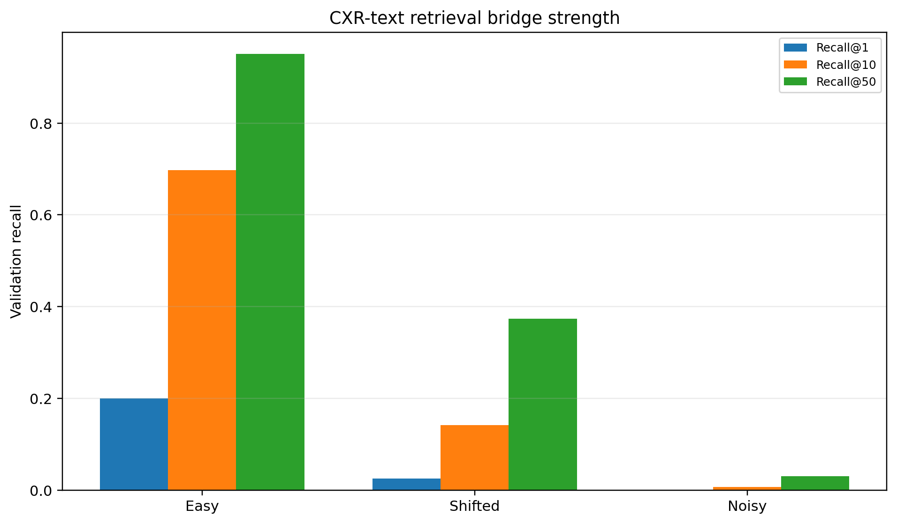
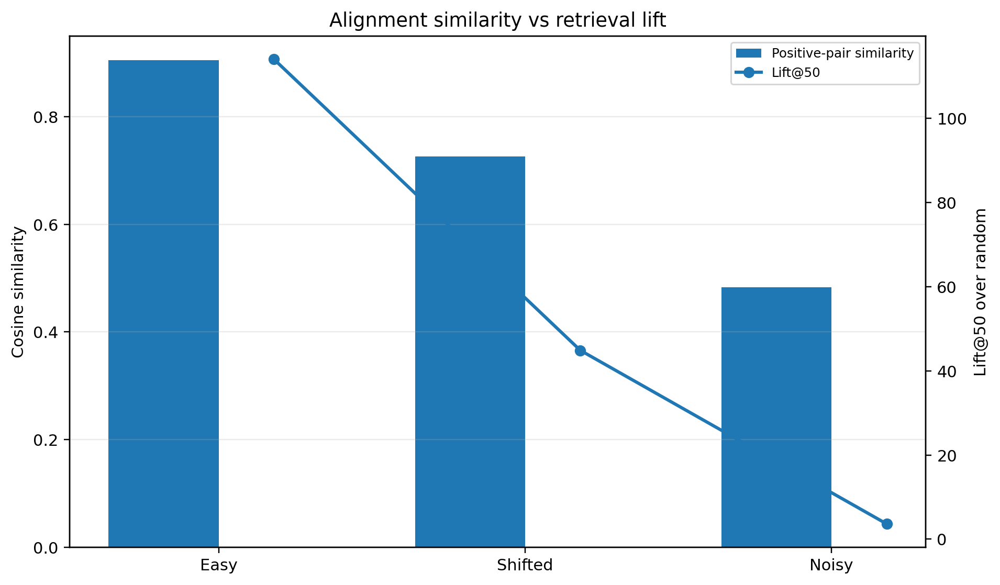
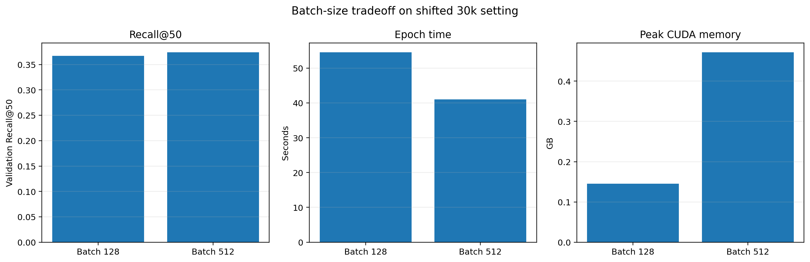

# CXR-Text Bridge Retrieval

A GPU-based diagnostic study of CXR-like image and radiology-report embedding alignment using contrastive retrieval training.

This repository studies when an image-text contrastive model can form a reliable retrieval bridge between chest-X-ray-like images and report/text embeddings.

The focus is not only whether the model learns, but whether the learned alignment is strong enough for retrieval.

---

## Core Question

```text
When does CXR-text contrastive pretraining form a reliable image-report retrieval bridge,
and when does the visual-text alignment fail?
```
## Why This Repo Exists

Medical vision-language models often rely on paired images and reports.

But reducing contrastive loss does not always mean the model can retrieve the correct report from a large candidate pool. This repository tests that gap directly.

The project evaluates:

- image-text alignment
- retrieval quality
- difficulty scaling
- batch-size behavior
- GPU training characteristics

---

## Experiment Design

The current benchmark uses controlled CXR-like synthetic images and report-style embeddings rather than real clinical data. This design is intentional: it allows the alignment signal, noise level, retrieval difficulty, and ground-truth pairing to be controlled before moving to authorized clinical datasets.

The experiment should therefore be interpreted as a pipeline and alignment-behavior validation study, not as a clinical-performance claim.

Three data modes are used:

| Mode | Meaning |
|---|---|
| easy | clear image-text alignment signal |
| shifted | harder cross-modal relationship |
| noisy | heavily corrupted image/text signal |

## Why Controlled Data Is Used

The current benchmark uses controlled CXR-like synthetic images and report-style embeddings instead of real clinical images.

This is intentional.

The goal of this stage is to validate the image-text contrastive retrieval pipeline under known conditions before moving to authorized clinical datasets. Controlled data makes it possible to define the true image-text pair, adjust the difficulty level, and observe when the retrieval bridge forms, weakens, or collapses.

In real clinical data, weak retrieval performance can come from many sources at once: noisy reports, imperfect image-report pairing, preprocessing differences, label ambiguity, or model limitations. The controlled setup isolates the alignment behavior of the training pipeline itself.

This repository should therefore be read as a GPU-based pipeline and alignment-behavior validation study, not as a clinical-performance claim.

---

## CXR-Text Retrieval Visualizations

The plots below summarize when the synthetic CXR-text retrieval bridge forms, weakens, or collapses.

<table>
  <tr>
    <th>Retrieval bridge</th>
    <th>Alignment similarity</th>
    <th>Batch-size tradeoff</th>
  </tr>
  <tr>
    <td width="33%">
      <a href="figures/cxr_text_retrieval_bridge.png">
        
      </a>
    </td>
    <td width="33%">
      <a href="figures/cxr_text_alignment_similarity.png">
        
      </a>
    </td>
    <td width="33%">
      <a href="figures/cxr_text_batch_compute_tradeoff.png">
        
      </a>
    </td>
  </tr>
</table>

Each panel links to the full-resolution figure.

| Panel | What to notice |
|---|---|
| **Retrieval bridge** | Easy mode forms a strong image-text bridge, shifted mode forms a weaker bridge, and noisy mode mostly collapses. |
| **Alignment similarity** | Positive-pair similarity and Lift@50 show whether image-text alignment produces retrieval signal beyond random chance. |
| **Batch-size tradeoff** | The shifted 30k comparison shows how batch size affects Recall@50, epoch time, and CUDA memory use. |

These figures are qualitative diagnostics. The main conclusions are based on the quantitative results in `experiments/results_table.csv`.

---

## Model

The model is a dual encoder:

| Branch | Encoder |
|---|---|
| Image | Compact CNN |
| Text | MLP projection over report/text embeddings |
| Shared space | L2-normalized embedding space |
| Loss | Symmetric InfoNCE |

---

## GPU Compute Setup

Experiments were run with CUDA-enabled PyTorch on:

```text
NVIDIA GeForce RTX 4090
CUDA 12.8
Mixed precision enabled
```

The training script records:

- epoch time
- peak CUDA memory
- batch size
- training loss
- Recall@K
- Lift@K
- positive-pair similarity

---

## Result Snapshot

The current benchmark includes:

```text
10k difficulty ladder:
easy / shifted / noisy

30k scale test:
easy / shifted / noisy

batch-size comparison:
shifted 30k, batch 512 vs batch 128
```

Summary:

| Setting | Main observation |
|---|---|
| easy | bridge forms strongly |
| shifted | bridge forms partially |
| noisy | bridge mostly collapses |
| batch 512 vs 128 | larger batch gives slightly stronger retrieval and faster epochs |

Full result interpretation:

- [GPU experiment summary](experiments/results_summary.md)
- [Collected result table](experiments/results_table.csv)

---

## Quick Start

Install dependencies:

```powershell
pip install -r requirements.txt
```

Generate a demo dataset:

```powershell
python src/make_demo_data.py --mode shifted --n-samples 10000 --n-groups 200 --image-size 64
```

Train a contrastive bridge model:

```powershell
python src/train.py --epochs 10 --batch-size 512 --num-workers 0 --output-dir outputs/shifted_demo --checkpoint-dir checkpoints/shifted_demo
```

Collect results:

```powershell
python src/collect_results.py
```

---

## Repository Structure

```text
cxr-text-bridge-retrieval/
│
├── src/
│   ├── make_demo_data.py
│   ├── dataset.py
│   ├── model.py
│   ├── metrics.py
│   ├── train.py
│   └── collect_results.py
│
├── docs/
│   └── project_framing.md
│
├── experiments/
│   ├── results_table.csv
│   └── results_summary.md
│
├── requirements.txt
└── README.md
```

Generated folders are intentionally ignored:

```text
data_generated/
outputs/
checkpoints/
```

---


## Related Work

This repository is motivated by medical image-text contrastive learning and chest X-ray vision-language pretraining.

The closest methodological reference is **ConVIRT**, which uses naturally paired medical images and reports with a bidirectional contrastive objective. This directly motivates the image-report retrieval setup used in this repository.

**MedCLIP** is also relevant because it studies medical image-text contrastive learning when image-text pairs are not strictly paired, and discusses false-negative issues in medical contrastive learning.

For chest-X-ray-specific vision-language learning, **BioViL / CXR-BERT** and **CXR-CLIP** are especially relevant. BioViL highlights the importance of radiology-specific text semantics, while CXR-CLIP studies large-scale chest X-ray language-image pretraining with contrastive objectives.

This repository does not claim clinical performance. It is a controlled GPU-based diagnostic experiment for studying when an image-text retrieval bridge forms, weakens, or collapses under different data difficulty settings.

---

## Scope

This repository uses synthetic CXR-like images and synthetic report embeddings to test the training and retrieval behavior of a CXR-text bridge pipeline.

The results should be interpreted as controlled evidence of alignment behavior, not as medical validation.

A natural next step is to replace the synthetic inputs with authorized real CXR images and report embeddings, then compare frozen versus partially trainable image encoders.

## References

- **ConVIRT**: Yuhao Zhang, Hang Jiang, Yasuhide Miura, Christopher D. Manning, and Curtis P. Langlotz. *Contrastive Learning of Medical Visual Representations from Paired Images and Text*. 2020/2022.

- **MedCLIP**: Zifeng Wang, Zhenbang Wu, Dinesh Agarwal, and Jimeng Sun. *MedCLIP: Contrastive Learning from Unpaired Medical Images and Text*. EMNLP, 2022.

- **BioViL / CXR-BERT**: Benedikt Boecking et al. *Making the Most of Text Semantics to Improve Biomedical Vision-Language Processing*. ECCV, 2022.

- **CXR-CLIP**: Kihyun You et al. *CXR-CLIP: Toward Large Scale Chest X-ray Language-Image Pre-training*. MICCAI, 2023.

## Documentation

- [Project framing](docs/project_framing.md)
- [GPU training protocol](docs/gpu_training_protocol.md)
- [Metric interpretation](docs/metric_interpretation.md)
